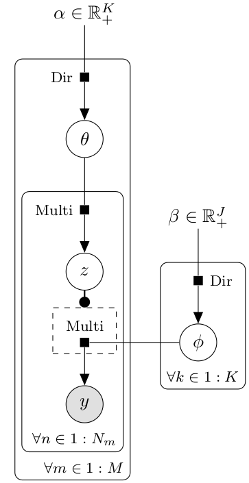

% Latent Dirichlet Allocation using Gibbs Sampling
% Yuncheng Li
  Computer Science, University of Rochester
% Apr. 30, 2014, BST512 Final Project

``` {r setup, include = F}
opts_chunk$set(cache = F, eval = T, echo = T, include = T, fig.width=18)
```

# Agenda

* Latent Dirichlet Allocation
* Algorithm
* Results on real data
* Simulations

# Motivation --- An Example
Example articles from [Associated Press](http://ap.org)

* 2,246 news articles
* 10,473 unique words
* 342,533 tokens


# Law/Legislation

*  ... went **committee** leaders ... receipts **members** four ... sits **senate** appropriations ...
*  ...   **house** thursday ... damage **bill** tally ... democrats **vote** followed ...
*  ... state **senate** seat ... january **senate** two ... get **bill** passed ... vetoed **bill** made ...
*  ... public **members** shared ... windfall **house** members ... house **members** accepted ...
*  ... new **congress** discuss ... rights **bill** push ... early **bill** defeated ...
*  ... brief **house** voted ... passed **house** earlier ... key **vote** senate ...
*  ... campaign **members** family ... nine **members** contributed ... family **members** made ...
*  ...   **house** tuesday ... rejected **legislation** protect ... men **house** defeated ...
*  ... dan **bill** give ... lautenberg **bill** bradley ... contend **bill** door ...

# Politics and Election

*  ... communist **party** milan ... communist **party** premier
*  ... polls **opposition** alliance ... municipal **elections** leading ... percent **vote** percent ...
*  ... leader **opposition** labor ... tony **party** conference ... leftist **party** moderate ...
*  ... man **national** front ... front **party** leader ... attended **political** meeting ...
*  ... association **national** made ... majority **elections** refuses
*  ... second **election** complete ... four **political** parties ... political **parties** opposing ...
*  ... participate **election** runoff ... alberto **political** favored ... months **election** campaigning ...
*  ... parliamentary **elections** held ... march **government** stopped ... voting **elections** held ...
*  ... democratic **party** labor ... labor **minister** december ... prime **minister** noboru ...
*  ... prime **minister** noboru ... accepted **political** donations ... named **political** supreme ...

# Business

*  ... acquired **million** shares ... singer **company** officials ... acquired **company** million ...
*  ... ran **company** dismantled
*  ... merger **offer** banca ... bank **new** york ... outstanding **offer** banca ...
*  ... dividend **share** common ... common **stock** santa ... pacific **share** shares ...
*  ... hostile **billion** tender ... tender **offer** food ... nabisco **share** best ...
*  ... back **million** kraft ... possible **company** excited ... partner **new** kohlberg ...
*  ... business **million** cash ... last **company** announced ... generated **company**   ...
*  ... buy **stock** coastamerica ... coastamerica **share** american ... tender **offer** five ...
*  ... macmillan **new** publishing ... services **company** offered ... acquire **billion** week ...
*  ... holding **company** subsidiary ... premiums **million** last ... revenues **billion** personal ...

# Police/Cases

*  ... raided **police** believe ... tuesday **found** searched ... last **two** weeks ...
*  ... fled **police** speeds ... state **police** boy ... satisfactory **police** names ...
*  ... patrolman **two** children ... away **found** hour ... tuesday **two** ages ...
*  ... looking **police** officer ... parked **two** weeks ... computer **found** notion ...
*  ... story **two** accidentally ... playing **police** girl ... told **police** two ...
*  ... nine **police** victims ... sunday **night** central ... taking **police** arrested ...
*  ...   **man** stabbed ... family **police** michael ... slashed **arrested** investigation ...
*  ... occurred **man** service ... handgun **shot** nelson ... assistance **man** police ...
*  ... allegedly **two** rented ... wounded **police** unidentified ... unidentified **man** treated ...
*  ... gunman **shot** two ... shot **two** people ... hostage **police** man ... police **man** shot ...

# Military/Army

*  ... four **people** leaving ... opened **police** regional ... march **killed** three ...
*  ... three **government** southern ... back **military** convoy ... liberation **army** captured ...
*  ...   **people** died ... five **police** hospital ... clashes **army** demonstrators ...
*  ... dubbed **people** fired ... armed **army** capable ... funds **government** allegations ...
*  ... british **military** barracks ... british **military** officials ... republican **army** blamed ...
*  ...   **government** supporters ... tuesday **people** witnesses ... reports **two** big ...
*  ... killing **people** injuring ... hundreds **people** died
*  ... british **army** reinforcements ... terrorist **army** army ... army **army** headquarters ...
*  ...   **police** clashed ... theater **security** source ... student **killed** four ...
*  ... occupied **army** barracks ... border **killed** undisclosed ... responsibility **reported** civilians ...

# What's LDA for?

From Wikipedia, LDA, ..., allows sets of observations to be explained by **unobserved groups** that explain why some **parts** of the data are similar.

* Discover latent topic space (explain the topic space and how it related to semantic affinity between documents)
* Identify keywords

# Other Applications

* Bioinformatics, [Functional Generality](http://www.psrg.csail.mit.edu/pubs/plos-comp-bio-2007.pdf)
* Linguistics
* Political science

...

# Notations



Follows [Integrating Out Multinomial Parameters in Latent Dirichlet Allocation and Naive Bayes for Collapsed Gibbs Sampling](http://lingpipe.files.wordpress.com/2010/07/lda3.pdf)

| Variables                     | Meaning                                    | Descriptions            |
|-------------------------------|--------------------------------------------|-------------------------|
| $M \in \mathbb{N}_{+}$        | number of documents                        | 3,000                   |
| $N_m \in \mathbb{N}_{+}$      | number of words in $m$-th document         | 100                     |
| $J$                           | number of unique words                     | 20,000                  |
| $K$                           | number of topics (predefined)              | 50                      |
| $y_{m,n} \in 1:J$             | $n$-th word of the $m$-th document         | 300K vector             |
| $z_{m,n} \in 1:K$             | topic assigned to $y_{m,n}$                | 300K vector             |
| $\theta_m \in [0,1]^K$        | topic distribution for document $m$        | 3,000 * 50 matrix, 150K |
| $\phi_k \in [0,1]^J$          | word distribution for topic $k$            | 20,000 * 50 matrix, 1M  |
| $\alpha \in \mathbb{R}_{+}^K$ | Dirichlet prior for $\theta_m$             | 0.01                    |
| $\beta \in \mathbb{R}_{+}^J$  | Dirichlet prior distributions for $\phi_k$ | 0.05                    |

* Topic is assigned to **individual words**, and document is a mixture of topics.
* Two key probabilities,
    1. $\theta_{k,m} := p(z_{m,n} = k), \forall n$
    1. $\phi_{k,j} := p(y_{m,n} = j | z_{m,n} = k), \forall (m,n)$
* Therefore,
$$
\begin{array}{rcl}
p(y_{m,n} = j) &=& \sum_k p(y_{m,n} = j, z_{m,n} = k)  \\
    &=& \sum_k p(y_{m,n} = j | z_{m,n} = k) p(z_{m,n} = k) \\
    &=& \sum_k \phi_{k,j} \theta_{k,m}
\end{array}
$$
* For a specific word in a document, the topic assigned to it depends on
    1. the word itself, i.e., $\phi_k$
    1. the overall topic distribution for the document, i.e., $\theta_m$

# Generative Process


1. Draw word distribution $\phi_k \sim \text{Dir}(\beta)$ for each topic $k$
1. Draw topic distribution $\theta_m \sim \text{Dir}(\alpha)$ for each document $m$
1. For each **SLOT** $n$ in document $m$, draw topic $z_{m,n} \sim \text{Multi}(\theta_m)$.
1. For each **SLOT** $n$ in document $m$, draw word $y_{m,n} \sim \text{Multi}(\phi_{z_{m,n}})$

Inference goal: given $y_{m,n}$, fit $\phi_k$, $\theta_m$ and $z_{m,n}$

Some important counts,

1. $c_{k,j}$ denotes, in any documents, how many times, word $j$ assigned to topic $k$
1. $c_{k,m}$ denotes, in document $m$, how many words assigned to topic $k$
1. $c_k$ denotes, throughout entire corpus, how many words assigned to topic $k$.
$$
c_k = \sum_j c_{k,j} = \sum_m c_{k,m}
$$

Once we have a draw of the vector $z_{m,n}$, we can compute these counts efficiently.

# Posteriors


* Joint posterior distribution,

$$
p(\phi, \theta, z | y, \alpha, \beta) \propto p(\phi|\beta) p(\theta|\alpha) p(z|\theta) p(y|\phi, z)
$$

* Conditional posteriors, (conjugacy, independency, and assume uniform Dirichlet prior $\alpha$ and $\beta$)
$$
p(\theta_m \in [0,1]^K| z, \alpha) = Dir(c_{k,m} + \alpha)
$$
$$
p(\phi_k \in [0,1]^J| z, \beta) = Dir(c_{k,j} + \beta)
$$
$$
\begin{array}{rcl}
p(z_{m,n} = \mathbb{k} | \phi_k, \theta_m, y_{m,n}) & \propto & p(\mathbb{k} | \theta_m) p(y_{m,n} | \mathbb{k}, \phi_k) \\
        &=& \phi_{\mathbb{k},y_{m,n}} \times \theta_{m, \mathbb{k}} \\
\end{array}
$$

* A gibbs sampler can built based on these equations.

* For many reasons, people usually infer such kind of posteriors using *collapsed gibbs sampling*.

* Note that the vector $z_{m,n}$ is a sufficient statistics for $\phi_k$ and $\theta_m$.

# Collapsed Gibbs Sampling


* Sample each dimension of the big vector $z_{m,n}$ one by one.
* $z_{-(m,n)}$ denotes topic assignment for all words except $z_{m,n}$. Note $z = z_{m,n} \cup z_{-(m,n)}$
$$
\begin{array}{rcl}
z_{m,n} & \sim & p(z_{m,n} | z_{-(m,n)}, y, \alpha, \beta) \\
        & \propto & p(z_{m,n}, z_{-(m,n)}, y|\alpha, \beta) \\
        & = & p(z,y| \alpha, \beta)
\end{array}
$$
* Note that $\phi_k$ and $\theta_m$ is missing in the above posterior, because they are integrated out from the joint posterior as following, (**collapsed**)
$$
p(z,y|\alpha, \beta) = \int \int p(y, z, \theta, \phi | \alpha, \beta) d\theta d\phi
$$
* By sophisticated derivations and keep only the terms relevant to $z_{m,n}$, we can simplify the integration as follows. The counts superscripted with $-(m,n)$ means the counts excluding $z_{m,n}$,

$$
p(z_{m,n} = \mathbb{k}| z_{-(m,n)}, y, \alpha, \beta) \propto \frac{(c_{\mathbb{k}, m}^{-(m,n)} + \alpha) \times (c_{\mathbb{k}, y_{m,n}}^{-(m,n)} + \beta)}{c_{\mathbb{k}}^{-(m,n)} + J * \beta}
$$

* Intuitively, estimate $\phi_k$ and $\theta_m$ using $z_{-(m,n)}$, then draw $z_{m,n}$ from $\theta_{m, k} \times \phi_{k,y_{m,n}}$

# Algorithm


$$
p(z_{m,n} = \mathbb{k}| z_{-(m,n)}, y, \alpha, \beta) \propto \frac{(c_{\mathbb{k}, m}^{-(m,n)} + \alpha) \times (c_{\mathbb{k}, y_{m,n}}^{-(m,n)} + \beta)}{c_{\mathbb{k}}^{-(m,n)} + J * \beta}
$$


1. Input: $y_{m,n}$
1. Random init $z_{m,n}$
1. Init the counts $c_{k,m}, c_{k,j}, c_{k}$ from $z_{m,n}$
1. for i = 1:niter
    * for each (m, n) do,
    1. $j \leftarrow y_{m,n}$
    1. $\mathbb{k} \leftarrow z_{m,n}$
    1. decrement counts $c_{\mathbb{k},m}$ -= 1, $c_{\mathbb{k},j}$ -= 1, $c_{\mathbb{k}}$ -= 1, (which are just $c_{k,m}^{-(m,n)}, c_{k,j}^{-(m,n)}, c_k^{-(m,n)}$)
    1. compute $p(z_{m,n}|...)$ using the above equation
    1. draw $z_{m,n} \rightarrow \mathbb{k}$
    1. increment counts $c_{\mathbb{k},m}$ += 1, $c_{\mathbb{k},j}$ += 1, $c_{\mathbb{k}}$ += 1.
1. Output: $z_{m,n}, c_{k,m}, c_{k,j}$ and $c_{k}$

# Implementations

* Computation complexity is $O(\text{niter}*MN*K)$.
* In one typical experiment, *niter* = 20000, *MN* = 342,000 and *K* = 50. Roughly 34 Billion floating point operations.
* Core sampling implemented with C++ (20 times faster than pure R implementation)
* 2 hours on average for single run.
* Simulations using clusters (72 nodes) in 24 hours.

# Results on real datasets
News articles from [Associated Press](http://ap.org), used by the [original LDA paper](http://www.cs.princeton.edu/~blei/papers/BleiNgJordan2003.pdf).

* 2,246 news articles $M$
* 10,473 unique words $J$
* 342,533 tokens $MN$

``` {r example-topics}
source('load.data.R')
source('./gibbs.vis.stat.R')

dataset.ap <- load.ap.data()
A <- gibbs.vis.stat(dataset.ap, do.save = F, param.id = 100, do.example = T)
```

# Examples

Following observations,

* Topics are ordered by 'popularity', i.e., $c_k$
* Trivial topics may be ordered very high
* Mostly politics or business for top 10 topics
* Some words are selected as keywords for many topics, such as 'i', 'government' and 'people' ...

Extensive list of example documents for discovered topics with keywords highlighted, (Note that these topics can **not be automatically named** by this method.)

* Topic # 0
    *  ... particular **officials** increased
    *  ...   **new** york ... market **new** nyse ... trades **made** customers
    *  ... existed **two** years
    *  ... efforts **president** move ... panama **president** bush ... bush **made** numerous ...
    *  ... talks **government** anc ... negotiation **new** phase ... african **government** repeal ...
    *  ... week **president** soviet ... first **time** general ... schedule **made** public ...
    *  ... suggested **president** kurt ... coalition **new** beginning ... presidential **told** reporters ...
    *  ... protect **president** bush ... frank **new** jersey ... bound **new** bombing ...
    *  ...   **government** advisory ... promoting **government** offices ... underground **government** report ...
    *  ... incumbent **president** longer ... incoming **president** lacks ... day **president** vice ...
* Topic # 1
    *  ...   **think** americans ... middle **i** think ... i **think** advised ... things **i** think ...
    *  ... word **people** world ... year **get** special ... estimated **people** get ...
    *  ... downtown **people** think ... people **think** beneath ... doing **i** think ...
    *  ...   **years** john ... recently **get** words ... asked **i** says ... issue **people** mom ...
    *  ... thought **years** afraid ... armstrong **i** come ... important **i** left ...
    *  ... jump **i** thought ... thinks **i** guys ... age **just** sitting ... eating **i** feel ...
    *  ... happens **i** think ... i **think** really
    *  ... got **get** users ... change **i** saw ... saw **i** saw ... entertainment **people** involved ...
* Topic # 2
    *  ... four **people** leaving ... opened **police** regional ... march **killed** three ...
    *  ... three **government** southern ... back **military** convoy ... liberation **army** captured ...
    *  ...   **people** died ... five **police** hospital ... clashes **army** demonstrators ...
    *  ... dubbed **people** fired ... armed **army** capable ... funds **government** allegations ...
    *  ... british **military** barracks ... british **military** officials ... republican **army** blamed ...
    *  ...   **government** supporters ... tuesday **people** witnesses ... reports **two** big ...
    *  ... killing **people** injuring ... hundreds **people** died
    *  ... british **army** reinforcements ... terrorist **army** army ... army **army** headquarters ...
    *  ...   **police** clashed ... theater **security** source ... student **killed** four ...
    *  ... occupied **army** barracks ... border **killed** undisclosed ... responsibility **reported** civilians ...
* Topic # 3
    *  ... operating **rate** mines ... november **rose** highest ... capacity **rose** percentage ...
    *  ... shot **percent** biggest ... increases **percent** january ... january **percent** march ...
    *  ... home **sales** march ... adjusted **million** unchanged ... number **sales** february ...
    *  ... construction **rose** moderate ... moderate **percent** government ... wednesday **new** homes ...
    *  ... britain **percent** august ... levels **year** highest ... highest **rate** inflation ...
    *  ... slowed **last** month ... annual **rate** just ... time **last** labor ...
    *  ... unemployment **rate** held ... steady **percent** last ... percent **last** month ...
    *  ... annual **rate** government ... lowest **percent** rate ... percent **rate** last ...
    *  ... plunged **percent** nine ... expected **last** three ... adjusted **billion** last ...
* Topic # 4
    *  ... raided **police** believe ... tuesday **found** searched ... last **two** weeks ...
    *  ... fled **police** speeds ... state **police** boy ... satisfactory **police** names ...
    *  ... patrolman **two** children ... away **found** hour ... tuesday **two** ages ...
    *  ... looking **police** officer ... parked **two** weeks ... computer **found** notion ...
    *  ... story **two** accidentally ... playing **police** girl ... told **police** two ...
    *  ... nine **police** victims ... sunday **night** central ... taking **police** arrested ...
    *  ...   **man** stabbed ... family **police** michael ... slashed **arrested** investigation ...
    *  ... occurred **man** service ... handgun **shot** nelson ... assistance **man** police ...
    *  ... allegedly **two** rented ... wounded **police** unidentified ... unidentified **man** treated ...
    *  ... gunman **shot** two ... shot **two** people ... hostage **police** man ...
* Topic # 5
    *  ...   **judge** bail ... district **attorney** original ... supreme **court** justice ...
    *  ...   **judge** sentenced ... patrolman **years** life ... life **prison** throwing ...
    *  ... pleaded **guilty** stealing ... federal **judge** district ... district **judge** thomas ...
    *  ... thursday **convicted** sam ... go **court** expect ... expect **guilty** difficult ...
    *  ... appeals **court** tuesday ... circuit **court** appeals ... officials **court** reversed ...
    *  ... federal **judge** friday ... six **years** prison ... years **prison** racketeering ...
    *  ... pleaded **guilty** murder ... murder **charges** slaying ... telling **court** thomas ...
    *  ... monday **years** federal ... federal **prison** corruption ... district **judge** edward ...
    *  ... second **trial** child ... acquitted **charges** peggy ... total **charges** prosecution ...
    *  ... impeachment **charges** issued ... urged **guilty** craft ... cooperate **attorney** investigation ...
* Topic # 6
    *  ... returns **democratic** races
    *  ... weicker **republican** senator
    *  ... results **democratic** presidential ... democratic **presidential** primary ...
    *  ... results **republican** races
    *  ...   **president** carter ... described **democratic** michael ... michael **dukakis** tuesday ...
    *  ... saturday **democratic** convention ... democratic **convention** delegates ...
    *  ... george **bush** headed ... mate **republican** presidential ... republican **presidential** weighing ...
    *  ... clear **democratic** beating ... jesse **jackson** albert ... vice **presidential** turn ...
    *  ... results **democratic** presidential ... democratic **presidential** caucuses ...
    *  ... governor **president** lyndon ... senate **republican** george ... george **bush** overwhelmed ...
* Topic # 7
    *  ... acquired **million** shares ... singer **company** officials ... acquired **company** million ...
    *  ... ran **company** dismantled
    *  ... merger **offer** banca ... bank **new** york ... outstanding **offer** banca ...
    *  ... dividend **share** common ... common **stock** santa ... pacific **share** shares ...
    *  ... hostile **billion** tender ... tender **offer** food ... nabisco **share** best ...
    *  ... back **million** kraft ... possible **company** excited ... partner **new** kohlberg ...
    *  ... business **million** cash ... last **company** announced ... generated **company**   ...
    *  ... buy **stock** coastamerica ... coastamerica **share** american ... tender **offer** five ...
    *  ... macmillan **new** publishing ... services **company** offered ... acquire **billion** week ...
    *  ... holding **company** subsidiary ... premiums **million** last ... revenues **billion** personal ...
* Topic # 8
    *  ... communist **party** milan ... communist **party** premier
    *  ... polls **opposition** alliance ... municipal **elections** leading ... percent **vote** percent ...
    *  ... leader **opposition** labor ... tony **party** conference ... leftist **party** moderate ...
    *  ... man **national** front ... front **party** leader ... attended **political** meeting ...
    *  ... association **national** made ... majority **elections** refuses
    *  ... second **election** complete ... four **political** parties ... political **parties** opposing ...
    *  ... participate **election** runoff ... alberto **political** favored ... months **election** campaigning ...
    *  ... parliamentary **elections** held ... march **government** stopped ... voting **elections** held ...
    *  ... democratic **party** labor ... labor **minister** december ... prime **minister** noboru ...
    *  ... prime **minister** noboru ... accepted **political** donations ... named **political** supreme ...
* Topic # 9
    *  ... went **committee** leaders ... receipts **members** four ... sits **senate** appropriations ...
    *  ...   **house** thursday ... damage **bill** tally ... democrats **vote** followed ...
    *  ... state **senate** seat ... january **senate** two ... get **bill** passed ...
    *  ... public **members** shared ... windfall **house** members ... house **members** accepted ...
    *  ... new **congress** discuss ... rights **bill** push ... early **bill** defeated ...
    *  ... brief **house** voted ... passed **house** earlier ... key **vote** senate ...
    *  ... campaign **members** family ... nine **members** contributed ... family **members** made ...
    *  ...   **house** tuesday ... rejected **legislation** protect ... men **house** defeated ...
    *  ... dan **bill** give ... lautenberg **bill** bradley ... contend **bill** door ...

# Traceplots

We can make following observations,

* Random select which documents $m$ (words $j$) to trace $\theta_{m,k}$ ($\phi_{k,j}$)
* Only top values are displayed.
* Note the $\phi_{k,j}$ at the bottom. The top values for this word are still near zero, which indicated this word rarely contributed to any topic.
* Out of the 5 randomly selected words, none of them are strong keywords.
* The convergence is not very well, but acceptable.

<font size=2> One strange trace, whose parameters are larger than 1. </font>
``` {r ap-traceplots}
A <- gibbs.vis.stat(dataset.ap, do.save = F, param.id = 100, do.trace = T)
```

# Perplexity
Another name for likelihood, but many different definitions for LDA model. I computed perplexity as follows,
$$
\text{Perplexity}(y^{un.obs}_{m,n} | \phi, \theta) = exp\left( -\frac{\sum_{m, n} \log p(y_{m,n}^{un.obs} | \phi, \theta)}{MN}\right)
$$
$$
p(y_{m,n} | \phi, \theta) = \sum_{k=1}^K \phi_{k, y_{m,n}} \theta_{m,k}
$$
For each document, keep a number of words as unobserved and the rest as observed. The observed words are used to infer $\phi_k$ and $\theta_m$. Using some point estimates of $\theta_m$ and $\phi_k$ from the gibbs draws, we can compute the *perplexity* for unobserved words.

Note that we can control the *ratio* of observed to unobserved words to see what the percentage of words we need to make good fit, which are evaluated in next page.

As the definition indicates, smaller perplexity means the fitted model can better explain unobserved data. Following is a plot of perplexity over iterations.

``` {r ap-perp, }
A <- gibbs.vis.stat(dataset.ap, do.save = F, param.id = 100, do.plot = T)
```

As we can see, perplexity decreases very fast to the converging point. 1000 iterations is enough

# Hyper-Parameters

Following is of our interests,

* How is the performance over different number of topics $K$.
* How about different *ratio* of observed words.

``` {r ap-param}
A <- gibbs.vis.stat(dataset.ap, do.save = T)
```

Here are our observations,

* Larger number of topics and more observed data can better explain the data.
* As $K$ and *ratio* increase, the effects decrease.

# Simulations


1. Draw true $\theta$ and $\phi$ from the Dirichlet prior, according to predefined $K$, $M$ and $N$.
1. Generate topics and words according to $\theta$ and $\phi$
1. Infer $\hat{\theta}$ (the last draw)
1. Compare $\theta$ and $\hat{\theta}$, and report the bias.

A problem with comparing $\theta$ and $\hat{\theta}$ directly: **non-identifiablity**. $\hat{\theta}$ can be arbitrary permutation of $\theta$.

In mixture model, one common practice is to find a optimal relabeling. Another approach is to measure **affinity correlations**.

# Affinity correlation

(Not a formal term, idea comes from a mixture model homework)

Given $\theta$, we can compute distance between each pair of documents $d(m_1, m_2)$ by
$$
d(m_1, m_2)_\theta = \sqrt{\sum_{k=1}^{K} \|\theta_{m_1, k} - \theta_{m_2, k}\|^2},
$$
which can be seen as a distance between $m_1$ and $m_2$ in the topic space.

*Affinity correlations*: $\text{cor} (d_\theta, d_\hat{\theta})$

Basic idea is if two documents is close in the group truth topic space $\theta$, they should be close in the estimated topic space $\hat{\theta}$.

Use a GMM to explain the idea.

It is treated as *pesudo bias* to evaluate simulations.

# Simulation results #1:

The number of topics is 50, which is relatively large.
``` {r sim-data,fig.width=8}
numTopics <- 50
sizeVocab <- 10000
numDocs <- 5000
averageDocumentLength <- 100
averageWordsPerTopic <- 10

n.rep <- 5

for (rep.i in 1:n.rep)
{
dataset.sim.50 <- load.sim.data(numTopics,
                           sizeVocab,
                           numDocs,
                           averageDocumentLength,
                           averageWordsPerTopic, rep.i)

A <- gibbs.vis.stat(dataset.sim.50, n.save = 100, do.save = T)
}
```

# Simulation results #2:

A smaller number of topics and model size is chosen.

``` {r sim-2,fig.width=8}
numTopics <- 5
sizeVocab <- 1000
numDocs <- 500
averageDocumentLength <- 100
averageWordsPerTopic <- 10

n.rep <- 5

for (rep.i in 1:n.rep)
{
dataset.sim.5 <- load.sim.data(numTopics,
                           sizeVocab,
                           numDocs,
                           averageDocumentLength,
                           averageWordsPerTopic, rep.i)

A <- gibbs.vis.stat(dataset.sim.5, n.save = 100, do.save = T)
}
```

# Simulations summary

* Sensitive to the choice of $K$. However, problems with $\hat{K} < K$ is more severe than the cases with $\hat{K} > K$.
* Perplexity, as a evaluation measurement, may or may not be related to real performance.

# Future work

* Apply Metropolis Hasting with good proposal variance to make larger jumps
* Diagnostics for this kind of *Big Model*
* More rich models

<!--
# Packages and References

* [Rcpp](http://www.rcpp.org/) for C++ integration
* [snow](http://cran.r-project.org/web/packages/snow/index.html), [foreach](http://cran.r-project.org/web/packages/foreach/index.html) for parallezation
* [knitr](http://yihui.name/knitr/) and [pandoc](http://johnmacfarlane.net/pandoc/) for documentation
* Stackoverflow
* Wikipedia
* [Original LDA-C code from the author](http://www.cs.princeton.edu/~blei/lda-c/),

# Thanks

* Prof. Thurston for so many help to get through the courses.
-->
